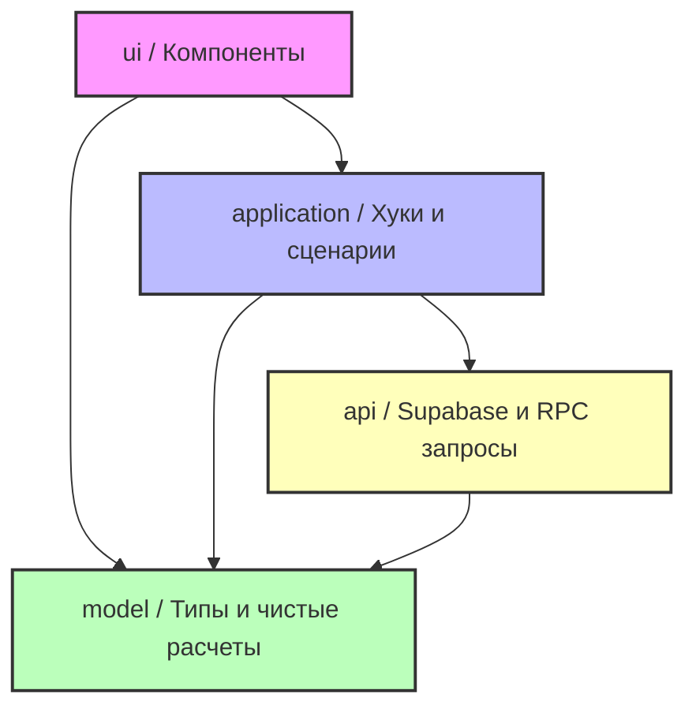

# Архитектурный стандарт: Разделение слоёв в feature-модулях

> **Дата создания:** 2026-05-30
> **Связано с EPIC:** [#196](https://github.com/huntechri/smetalabs/issues/196)
> **Статус документа:** Действующий стандарт

---

## 🎯 Назначение

Настоящий стандарт фиксирует правила структурирования папок и кода внутри каждого бизнес-модуля (`features/<feature-name>`). 

Цель разделения — полностью отделить логику представления (UI) от бизнес-логики (Model), сценариев использования (Application) и способов получения данных (API). Это повышает тестируемость системы, изолирует инфраструктурные изменения и упрощает когнитивную нагрузку при доработке кодовой базы.

---

## 🏗️ Целевая структура папок

Каждый feature-модуль должен придерживаться следующей структуры директорий:

```txt
features/<feature-name>/
├── api/                  # Слой доступа к данным (Supabase, RPC, HTTP)
│   └── <feature>-api.ts  # Репозиторий или функции запросов
├── model/                # Чистый домен (расчёты, типы, константы)
│   ├── types.ts          # Специфичные типы фичи (если не общие)
│   └── calculations.ts   # Чистые математические и бизнес-расчёты
├── application/          # Сценарии и оркестрация (React Query, hooks)
│   └── use-<feature>.ts  # Основной хук управления состоянием/запросами
└── ui/                   # Слой отображения (JSX, верстка, локальный стейт)
    ├── <feature>-view.tsx      # Главный компонент-контейнер страницы
    ├── <feature>-card.tsx      # Вспомогательные компоненты
    └── <feature>-dialog.tsx    # Формы, диалоги
```

---

## 🔬 Подробное описание слоёв

### 1. `ui` (User Interface)
* **Назначение**: Только отрисовка интерфейса, верстка и обработка простейших пользовательских событий (клик, ввод).
* **Что содержит**: React-компоненты, формы, таблицы, карточки, модальные окна, локальное состояние отображения (например, `isOpen`, `activeTab`).
* **Разрешённые импорты**: 
  * `application/` — кастомные хуки для выполнения действий и получения данных.
  * `model/` — типы, константы и простые селекторы.
  * `components/ui/` — низкоуровневые shadcn/ui примитивы.
  * `lib/utils` — хелпер `cn` для Tailwind CSS классов.
* **Запрещённые импорты**:
  * ❌ Прямой импорт из `api/`. UI никогда не знает, откуда берутся данные.
  * ❌ Прямые вызовы `@supabase/supabase-js`, `lib/supabase/client` или `lib/supabase/server`.
  * ❌ Бизнес-расчёты на лету внутри JSX (например, сложные калькуляции сумм, налогов).
  * ❌ Прямой импорт и конфигурация `queryClient` ( TanStack Query).

### 2. `model` (Domain Model)
* **Назначение**: Чистая бизнес-логика. Должна быть написана на чистом JavaScript/TypeScript и не зависеть от фреймворка или библиотек хранения/передачи данных.
* **Что содержит**: TypeScript-интерфейсы, константы, мапперы данных, хелперы статусов, чистые функции расчётов (например, калькулятор стоимости сметы, валидаторы домена).
* **Разрешённые импорты**: 
  * Общие типы из корневого каталога `types/`.
  * Сторонние библиотеки чистых утилит (например, `zod` для валидации, если применимо).
* **Запрещённые импорты**:
  * ❌ **Любые зависимости от React** (`useClient`, `useState`, компоненты).
  * ❌ Любые инфраструктурные зависимости: Supabase, TanStack Query, Next.js router (`next/navigation`), `toast` сообщения.
  * ❌ Обращение к глобальным объектам браузера (`window`, `document`) без крайней необходимости.

### 3. `application` (Use Cases / Scenarios)
* **Назначение**: Оркестрация бизнес-процессов, управление асинхронным жизненным циклом данных и обработка сценариев («Загрузить X -> Если ок, показать тост -> Обновить кэш Y -> Выполнить редирект»).
* **Что содержит**: Кастомные хуки React, обёртки TanStack Query (`useQuery`, `useMutation`), логика инвалидации кэша, вызов уведомлений (`toast`), переходы по страницам (`useRouter`).
* **Разрешённые импорты**:
  * `api/` — функции получения данных и репозитории.
  * `model/` — типы, мапперы и функции бизнес-логики.
  * `@tanstack/react-query` — хуки запросов/мутаций.
  * Корневые библиотеки для UI-эффектов: `sonner` (toast), `next/navigation` (router).
* **Запрещённые импорты**:
  * ❌ Компоненты из слоя `ui/`. Слой `application` не должен знать, как выглядят кнопки и таблицы.
  * ❌ Прямые SQL/RPC вызовы к Supabase (они должны быть инкапсулированы в `api/`).

### 4. `api` (Data Access)
* **Назначение**: Взаимодействие с внешним миром (база данных, сторонние сервисы, HTTP).
* **Что содержит**: Клиенты API, репозитории данных, RPC-обёртки, адаптеры сетевых данных к внутренним типам модели.
* **Разрешённые импорты**:
  * `lib/supabase/client.ts` и `lib/supabase/server.ts` для выполнения запросов.
  * `types/` и `model/` для типов возвращаемых данных.
* **Запрещённые импорты**:
  * ❌ Любые React-зависимости (компоненты, хуки).
  * ❌ Хуки TanStack Query ( TanStack Query управляет кэшем в `application`, но не делает запросы сам).
  * ❌ Слой `ui/` и `application/`.

---

## 🗺️ Карта зависимостей между слоями

Связи между слоями строго направлены сверху вниз:



---

## 🔄 Общий шаблон миграции feature-модуля

Рефакторинг модуля должен выполняться строго по следующим этапам:

### Шаг 1: Анализ кодовой базы фичи
* Найдите все места в текущих компонентах, где выполняются:
  * Прямые обращения к Supabase (например, `supabase.from(...)` или вызовы RPC).
  * Сложная бизнес-математика (расчет сумм, фильтрация по бизнес-правилам, маппинг данных).
  * Вызовы TanStack Query (`useQuery`, `useMutation`).

### Шаг 2: Создание структуры папок
* Создайте папки `ui`, `model`, `application`, `api` в корне рефакторенной фичи (`features/<feature-name>/`).

### Шаг 3: Выделение слоя API (`api/`)
* Перенесите все вызовы Supabase, RPC-функций и HTTP-запросов в файл `api/<feature-name>-api.ts`.
* Функции должны принимать параметры и возвращать промисы с типизированным результатом.

### Шаг 4: Выделение слоя домена (`model/`)
* Перенесите типы данных, константы, мапперы и чистые вычислительные функции в файлы `model/types.ts` и `model/calculations.ts`.
* Устраните любые импорты React, хуков, toast-уведомлений и Supabase.
* Напишите Unit-тесты для функций расчетов в `model/calculations.test.ts` (запуск через `pnpm test`).

### Шаг 5: Выделение сценариев (`application/`)
* Напишите кастомные React-хуки в `application/use-<feature-name>.ts`.
* Перенесите в них вызовы `useQuery`, `useMutation`, управление кэшем TanStack Query (`queryClient.invalidateQueries`), обработку редиректов и показ toast-уведомлений.

### Шаг 6: Перенос и рефакторинг UI (`ui/`)
* Перенесите все JSX-компоненты в директорию `ui/`.
* Замените прямые запросы к БД и расчеты внутри компонентов на использование хуков из `application/` и чистых функций из `model/`.

### Шаг 7: Локальная верификация
* Запустите проверку типов: `pnpm typecheck`.
* Запустите тесты: `pnpm test`.
* Вручную проверьте работоспособность сценариев в браузере.

---

## 📝 Чек-лист для Pull Request (PR)

Каждое изменение в рамках рефакторинга по разделению слоёв обязано проходить проверку по данному чек-листу:

- [ ] **Отсутствие изменений в поведении**: В описании PR явно указана строка:
  ```txt
  Behavior changes: none
  ```
- [ ] **Изолированность**: PR затрагивает строго одну фичу или область, без «смешивания» других рефакторингов.
- [ ] **Отсутствие запрещенных импортов**:
  * UI компоненты не импортируют `api/` и клиентов Supabase.
  * Слой `model/` не импортирует React и внешние библиотеки работы с данными.
  * Слой `api/` не содержит React-кода.
- [ ] **Тестирование**: Для всех критических вычислений в слое `model` добавлены unit-тесты (с использованием Vitest).
- [ ] **Сохранение API контракта**: Все внешние вызовы (RPC, схемы, REST) сохранены без изменений. Если изменилась структура локальных данных — добавлен mapper/adapter.
